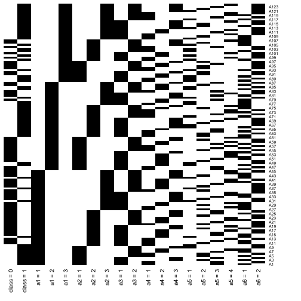

# MONKS Problems  - Clustering of Implications
## Clustering of problem MONKS-1

First, we load the needed libraries


```r
# Suppress summarise info
options(dplyr.summarise.inform = FALSE)
options(tidyverse.quiet = TRUE)
if (!require("tidyverse", quietly = TRUE)) {
  
  install.packages("tidyverse")
  library("tidyverse")
  
}
if (!require("cluster", quietly = TRUE)) {
  
  install.packages("cluster")
  library("cluster")
  
}
if (!require("fcaR", quietly = TRUE)) {
  
  install.packages("fcaR")
  library("fcaR")
  
}
if (!("MASS" %in% installed.packages())) {
  
  install.packages("MASS")
  
}
```

Load other functions needed to compute implication
distances and perform clustering.


```r
source("./distances_registry.R")
source("./implication_distance.R")
source("./cluster.R")
source("./one_hot.R")
source("./count_attributes.R")
```

These are the available distances in this work


```r
available_dist <- c("manhattan", "jaccard", "cosine")
```

Read the dataset


```r
monks <- readr::read_delim("MONKS/monks-1.train", 
                           col_types = cols(),
                           col_names = FALSE,
                           delim = " ",
                           trim_ws = TRUE)

# monks_classes <- monks[, 1]
monks <- monks %>% 
  select(-X8) %>% 
  set_names(c("class", paste0("a", 1:6))) %>% 
  mutate_if(is.numeric, as_factor) %>% 
  mutate(across(everything(), one_hot)) %>% 
  reduce(.f = cbind)
```

Build the formal context, plot it, and find the 
Duquenne-Guigues basis


```r
fc_monks <- FormalContext$new(monks)
fc_monks$plot()
```



```r
fc_monks$find_implications(save_concepts = FALSE, 
                           verbose = FALSE)
```

Let us retain only those implications where not 
all the attributes appear


```r
imps <- fc_monks$implications$clone()
imps <- imps[imps$support() > 0]
imps$cardinality()
```

```
## [1] 505
```

Compute the Hamming (or Manhattan) distance


```r
Distances <- impl_dist(imps, method = "Manhattan")
```

And consider the dissimilarity as 
$\text{diss}(P \to Q, R \to T) = d(P, R) + d(P^+, R^+)$


```r
Dimps <- Distances$closure + Distances$left 
```

Let us find $k=2$ clusters


```r
k <- 2
CL <- cluster_implications(Dimps, k = k)
```

The 2 medoids for these clusters are


```r
imps[CL$representatives]
```

```
## Implication set with 2 implications.
## Rule 1: {a5 = 1} -> {class = 1}
## Rule 2: {class = 0, a2 = 1, a5 = 2} -> {a6 = 2}
```

Now, we can represent in 2D the implication space
with each cluster in a different color,
marking the two medoids.

First, we perform multidimensional scaling to obtain
the point cloud representing implications.


```r
imp_mds <- MASS::isoMDS(Dimps, k = 2, trace = FALSE,
                        tol = 1e-7, maxit = 100)
```

Create a vector that indicates which implications are
the two central implications:


```r
is_repres <- rep(FALSE, imps$cardinality())
is_repres[CL$representatives] <- TRUE
```

And plot all the data


```r
df <- imp_mds$point %>% as.data.frame() %>% 
  as_tibble() %>%  
  set_names(c("x", "y")) %>% 
  mutate(cluster = factor(CL$clustering),
         row = seq_along(CL$clustering),
         repres = is_repres)

ggplot(df, aes(x = x, y = y, color = cluster, label = row)) + 
  geom_point(aes(shape = is_repres)) +
  scale_color_discrete(type = "div") +
  theme_void() + 
  theme(legend.position = "none",
        axis.line = element_line(size = 0))
```


# Study of Closure Purity
Let us study _closure purity_, that is, the proportion
of equivalence classes given by closed sets that are
completely assigned to a same cluster.
Let us test the three considered distances


```r
available_dist <- c("Manhattan", "jaccard", "cosine")
names(available_dist) <- available_dist
```

Store results in a list


```r
this_problem <- list()
```

Loop over problem index (MONKS-1, MONKS-2 and MONKS-3)


```r
for (problem_id in seq(3)) {
  
  # Read the problem
  monks <- readr::read_delim(
    glue::glue("MONKS/monks-{problem_id}.train"), 
    col_types = cols(),
    col_names = FALSE,
    delim = " ",
    trim_ws = TRUE)
  
  monks <- monks %>% 
    select(-X8) %>% 
    set_names(c("class", paste0("a", 1:6))) %>% 
    mutate_if(is.numeric, as_factor) %>% 
    mutate(across(everything(), one_hot)) %>% 
    reduce(.f = cbind)
  
  fc_monks <- FormalContext$new(monks)
  fc_monks$find_implications(save_concepts = FALSE, 
                             verbose = FALSE)
  
  imps <- fc_monks$implications$clone()
  imps <- imps[imps$support() > 0]
  
  LHSRHS <- fcaR:::.union(imps$get_LHS_matrix(),
                          imps$get_RHS_matrix())
  
  # Here we store a summary of all the equivalence classes
  # of implications
  closed_sets <- apply(as.matrix(fcaR:::.equal_sets(LHSRHS)), 1, 
                       function(x) {
                         
                         which(x > 0)[1]
                         
                       }
  )
  
  # diss(P -> Q, R -> T) := d(P, R)
  # for each distance measure, ...
  resultsL <- lapply(
    available_dist,
    function(m) {
      
      # ... compute the dissimilarity matrix
      Distances <- impl_dist(imps, method = m)
      Dimps <- Distances$left
      
      # ... cluster the implications
      CL <- cluster_implications(Dimps, k = k)
      
      # ... and compute purity
      purity <- 1 - apply(table(CL$clustering, closed_sets), 2, 
                    function(s) s[1] > 0 & s[2] > 0) %>% mean()

      return(list(purity = purity))
      
    })
  
  # diss(P -> Q, R -> T) := d(P, R) + d(P^+, R^+)
  # for each distance measure, ...
  resultsLC <- lapply(
    available_dist,
    function(m) {
      
      # ... compute the dissimilarity matrix
      Distances <- impl_dist(imps, method = m)
      Dimps <- Distances$left + Distances$closure
      
      # ... cluster the implications
      CL <- cluster_implications(Dimps, k = k)
      
      # ... and compute purity
      purity <- 1 - apply(table(CL$clustering, closed_sets), 2, 
                          function(s) s[1] > 0 & s[2] > 0) %>% mean()
      
      return(list(purity = purity))
      
    })
  
  # diss(P -> Q, R -> T) := d(P, R) + d(Q, T) + d(P^+, R^+)
  # for each distance measure, ...
  resultsLRC <- lapply(
    available_dist,
    function(m) {
      
      # ... compute the dissimilarity matrix
      Distances <- impl_dist(imps, method = m)
      Dimps <- Distances$left + Distances$right + Distances$closure
      
      # ... cluster the implications
      CL <- cluster_implications(Dimps, k = k)
      
      # ... and compute purity
      purity <- 1 - apply(table(CL$clustering, closed_sets), 2, 
                          function(s) s[1] > 0 & s[2] > 0) %>% mean()
      
      return(list(purity = purity))
      
    })
  
  # diss(P -> Q, R -> T) := d(P, R) + d(Q, T)
  # for each distance measure, ...
  resultsLR <- lapply(
    available_dist,
    function(m) {
      
      # ... compute the dissimilarity matrix
      Distances <- impl_dist(imps, method = m)
      Dimps <- Distances$left + Distances$right
      
      # ... cluster the implications
      CL <- cluster_implications(Dimps, k = k)
      
      # ... and compute purity
      purity <- 1 - apply(table(CL$clustering, closed_sets), 2, 
                          function(s) s[1] > 0 & s[2] > 0) %>% mean()
      
      return(list(purity = purity))
      
    })
  
  # diss(P -> Q, R -> T) := d(P^+, R^+)
  # for each distance measure, ...
  resultsC <- lapply(
    available_dist,
    function(m) {
      
      # ... compute the dissimilarity matrix
      Distances <- impl_dist(imps, method = m)
      Dimps <- Distances$closure
      
      # ... cluster the implications
      CL <- cluster_implications(Dimps, k = k)
      
      # ... and compute purity
      purity <- 1 - apply(table(CL$clustering, closed_sets), 2, 
                          function(s) s[1] > 0 & s[2] > 0) %>% mean()
      
      return(list(purity = purity))
      
    })
  
  # Binding results
  this_problem[[problem_id]] <- list()
  
  this_problem[[problem_id]]$summary <-
    rbind(resultsL %>% map_dbl(~ .$purity),
          resultsC %>% map_dbl(~ .$purity),
          resultsLR %>% map_dbl(~ .$purity),
          resultsLC %>% map_dbl(~ .$purity),
          resultsLRC %>% map_dbl(~ .$purity)
    ) %>%
    as_tibble() %>%
    add_column(Dissimilarity = c("dis_1", 
                          "dis_2",
                          "dis_3", 
                          "dis_4",
                          "dis_5"),
               .before = 1) %>%
    add_column(Problem = paste0("MONKS-", problem_id),
               .before = 1)
  
  this_problem[[problem_id]]$results <- list(
    resultsC = resultsC,
    resultsL = resultsL,
    resultsLC = resultsLC,
    resultsLR = resultsLR,
    resultsLRC = resultsLRC)
  
}


all_results <- this_problem %>% 
  map_df(~ .$summary)

all_results %>% 
  knitr::kable(format = "html",
               digits = 3,
               booktabs = TRUE,
               align = "ccccc")
```

<table>
 <thead>
  <tr>
   <th style="text-align:center;"> Problem </th>
   <th style="text-align:center;"> Dissimilarity </th>
   <th style="text-align:center;"> Manhattan </th>
   <th style="text-align:center;"> jaccard </th>
   <th style="text-align:center;"> cosine </th>
  </tr>
 </thead>
<tbody>
  <tr>
   <td style="text-align:center;"> MONKS-1 </td>
   <td style="text-align:center;"> dis_1 </td>
   <td style="text-align:center;"> 0.953 </td>
   <td style="text-align:center;"> 1.000 </td>
   <td style="text-align:center;"> 0.983 </td>
  </tr>
  <tr>
   <td style="text-align:center;"> MONKS-1 </td>
   <td style="text-align:center;"> dis_2 </td>
   <td style="text-align:center;"> 1.000 </td>
   <td style="text-align:center;"> 1.000 </td>
   <td style="text-align:center;"> 1.000 </td>
  </tr>
  <tr>
   <td style="text-align:center;"> MONKS-1 </td>
   <td style="text-align:center;"> dis_3 </td>
   <td style="text-align:center;"> 0.962 </td>
   <td style="text-align:center;"> 0.953 </td>
   <td style="text-align:center;"> 0.953 </td>
  </tr>
  <tr>
   <td style="text-align:center;"> MONKS-1 </td>
   <td style="text-align:center;"> dis_4 </td>
   <td style="text-align:center;"> 1.000 </td>
   <td style="text-align:center;"> 1.000 </td>
   <td style="text-align:center;"> 0.971 </td>
  </tr>
  <tr>
   <td style="text-align:center;"> MONKS-1 </td>
   <td style="text-align:center;"> dis_5 </td>
   <td style="text-align:center;"> 1.000 </td>
   <td style="text-align:center;"> 0.988 </td>
   <td style="text-align:center;"> 0.962 </td>
  </tr>
  <tr>
   <td style="text-align:center;"> MONKS-2 </td>
   <td style="text-align:center;"> dis_1 </td>
   <td style="text-align:center;"> 0.928 </td>
   <td style="text-align:center;"> 0.966 </td>
   <td style="text-align:center;"> 0.942 </td>
  </tr>
  <tr>
   <td style="text-align:center;"> MONKS-2 </td>
   <td style="text-align:center;"> dis_2 </td>
   <td style="text-align:center;"> 1.000 </td>
   <td style="text-align:center;"> 1.000 </td>
   <td style="text-align:center;"> 1.000 </td>
  </tr>
  <tr>
   <td style="text-align:center;"> MONKS-2 </td>
   <td style="text-align:center;"> dis_3 </td>
   <td style="text-align:center;"> 0.986 </td>
   <td style="text-align:center;"> 0.966 </td>
   <td style="text-align:center;"> 0.974 </td>
  </tr>
  <tr>
   <td style="text-align:center;"> MONKS-2 </td>
   <td style="text-align:center;"> dis_4 </td>
   <td style="text-align:center;"> 0.994 </td>
   <td style="text-align:center;"> 1.000 </td>
   <td style="text-align:center;"> 0.998 </td>
  </tr>
  <tr>
   <td style="text-align:center;"> MONKS-2 </td>
   <td style="text-align:center;"> dis_5 </td>
   <td style="text-align:center;"> 0.996 </td>
   <td style="text-align:center;"> 0.954 </td>
   <td style="text-align:center;"> 0.974 </td>
  </tr>
  <tr>
   <td style="text-align:center;"> MONKS-3 </td>
   <td style="text-align:center;"> dis_1 </td>
   <td style="text-align:center;"> 0.923 </td>
   <td style="text-align:center;"> 1.000 </td>
   <td style="text-align:center;"> 0.972 </td>
  </tr>
  <tr>
   <td style="text-align:center;"> MONKS-3 </td>
   <td style="text-align:center;"> dis_2 </td>
   <td style="text-align:center;"> 1.000 </td>
   <td style="text-align:center;"> 1.000 </td>
   <td style="text-align:center;"> 1.000 </td>
  </tr>
  <tr>
   <td style="text-align:center;"> MONKS-3 </td>
   <td style="text-align:center;"> dis_3 </td>
   <td style="text-align:center;"> 0.935 </td>
   <td style="text-align:center;"> 0.985 </td>
   <td style="text-align:center;"> 0.978 </td>
  </tr>
  <tr>
   <td style="text-align:center;"> MONKS-3 </td>
   <td style="text-align:center;"> dis_4 </td>
   <td style="text-align:center;"> 1.000 </td>
   <td style="text-align:center;"> 0.997 </td>
   <td style="text-align:center;"> 0.994 </td>
  </tr>
  <tr>
   <td style="text-align:center;"> MONKS-3 </td>
   <td style="text-align:center;"> dis_5 </td>
   <td style="text-align:center;"> 1.000 </td>
   <td style="text-align:center;"> 0.994 </td>
   <td style="text-align:center;"> 0.966 </td>
  </tr>
</tbody>
</table>

## Study of common attributes in each cluster

Now, we can check which attributes are common in each cluster
We consider an attribute as common if it's in more than
an 80% of the implications of the cluster.


```r
threshold <- 0.8
```

Loop oveer the problems, performing clustering and determining
common attributes


```r
this_problem <- list()
for (problem_id in seq(3)) {
  
  # Import the dataset
  monks <- readr::read_delim(
    glue::glue("MONKS/monks-{problem_id}.train"), 
    col_types = cols(),
    col_names = FALSE,
    delim = " ",
    trim_ws = TRUE)
  
  monks <- monks %>% 
    select(-X8) %>% 
    set_names(c("class", paste0("a", 1:6))) %>% 
    mutate_if(is.numeric, as_factor) %>% 
    mutate(across(everything(), one_hot)) %>% 
    reduce(.f = cbind)
  
  # Find the Duquenne-Guigues basis
  fc_monks <- FormalContext$new(monks)
  fc_monks$find_implications(save_concepts = FALSE, 
                             verbose = FALSE)
  
  imps <- fc_monks$implications$clone()
  imps <- imps[imps$support() > 0]
  
  # diss(P -> Q, R -> T) := d(P, R)
  # for each distance function...
  resultsL <- lapply(
    available_dist,
    function(m) {
      
      # ... compute the dissimilarity matrix
      Distances <- impl_dist(imps, method = m)
      Dimps <- Distances$left
      
      # ... cluster the implications
      CL <- cluster_implications(Dimps, k = k)
      
      # ... count attributes
      att_counts <- list()
      for (i in seq(k)) {
        
        att_counts[[i]] <- count_attributes(imps[CL$clustering == i])
        
      }
      
      att_counts <- t(do.call(rbind, att_counts))
      
      # ...find the proportion of times an attribute is present
      att_proportion <- att_counts %>% 
        scale(center = FALSE, 
              scale = table(CL$clustering))
      
      # ... and filter if its above the predefined threshold
      att_proportion[] <- as.numeric(att_proportion >= threshold)
      
      # ... determine which are the common attributes
      common <- apply(att_proportion, 2, 
                      function(s) {
                        
                        S <- SparseSet$new(
                          attributes = imps$get_attributes(),
                          M = s)
                        
                        fcaR:::.set_to_string(S$get_vector(),
                                              S$get_attributes())

                      })
      
      return(common)
      
      
    })
  
  # diss(P -> Q, R -> T) := d(P, R) + d(P^+, R^+)
  # for each distance function...
  resultsLC <- lapply(
    available_dist,
    function(m) {
      
      # ... compute the dissimilarity matrix
      Distances <- impl_dist(imps, method = m)
      Dimps <- Distances$closure + Distances$left
      
      # ... cluster the implications
      CL <- cluster_implications(Dimps, k = k)
      
      # ... count attributes
      att_counts <- list()
      for (i in seq(k)) {
        
        att_counts[[i]] <- count_attributes(imps[CL$clustering == i])
        
      }
      
      att_counts <- t(do.call(rbind, att_counts))
      
      # ...find the proportion of times an attribute is present
      att_proportion <- att_counts %>% 
        scale(center = FALSE, 
              scale = table(CL$clustering))
      
      # ... and filter if its above the predefined threshold
      att_proportion[] <- as.numeric(att_proportion >= threshold)
      
      # ... determine which are the common attributes
      common <- apply(att_proportion, 2, 
                      function(s) {
                        
                        S <- SparseSet$new(
                          attributes = imps$get_attributes(),
                          M = s)
                        
                        fcaR:::.set_to_string(S$get_vector(),
                                              S$get_attributes())
                        
                      })
      
      return(common)
      
    })
  
  # diss(P -> Q, R -> T) := d(P, R) + d(Q, T) + d(P^+, R^+)
  # for each distance function...
  resultsLRC <- lapply(
    available_dist,
    function(m) {
      
      # ... compute the dissimilarity matrix
      Distances <- impl_dist(imps, method = m)
      Dimps <- Distances$closure + Distances$left + Distances$right
      
      # ... cluster the implications
      CL <- cluster_implications(Dimps, k = k)
      
      # ... count attributes
      att_counts <- list()
      for (i in seq(k)) {
        
        att_counts[[i]] <- count_attributes(imps[CL$clustering == i])
        
      }
      
      att_counts <- t(do.call(rbind, att_counts))
      
      # ...find the proportion of times an attribute is present
      att_proportion <- att_counts %>% 
        scale(center = FALSE, 
              scale = table(CL$clustering))
      
      # ... and filter if its above the predefined threshold
      att_proportion[] <- as.numeric(att_proportion >= threshold)
      
      # ... determine which are the common attributes
      common <- apply(att_proportion, 2, 
                      function(s) {
                        
                        S <- SparseSet$new(
                          attributes = imps$get_attributes(),
                          M = s)
                        
                        fcaR:::.set_to_string(S$get_vector(),
                                              S$get_attributes())
                        
                      })
      
      return(common)  
      
    })
  
  # diss(P -> Q, R -> T) := d(P, R) + d(Q, T)
  # for each distance function...
  resultsLR <- lapply(
    available_dist,
    function(m) {
      
      # ... compute the dissimilarity matrix
      Distances <- impl_dist(imps, method = m)
      Dimps <- Distances$left + Distances$right
      
      # ... cluster the implications
      CL <- cluster_implications(Dimps, k = k)
      
      # ... count attributes
      att_counts <- list()
      for (i in seq(k)) {
        
        att_counts[[i]] <- count_attributes(imps[CL$clustering == i])
        
      }
      
      att_counts <- t(do.call(rbind, att_counts))
      
      # ...find the proportion of times an attribute is present
      att_proportion <- att_counts %>% 
        scale(center = FALSE, 
              scale = table(CL$clustering))
      
      # ... and filter if its above the predefined threshold
      att_proportion[] <- as.numeric(att_proportion >= threshold)
      
      # ... determine which are the common attributes
      common <- apply(att_proportion, 2, 
                      function(s) {
                        
                        S <- SparseSet$new(
                          attributes = imps$get_attributes(),
                          M = s)
                        
                        fcaR:::.set_to_string(S$get_vector(),
                                              S$get_attributes())
                        
                      })
      
      return(common)  
      
    })
  
  # diss(P -> Q, R -> T) := d(P^+, R^+)
  # for each distance function...
  resultsC <- lapply(
    available_dist,
    function(m) {
      
      # ... compute the dissimilarity matrix
      Distances <- impl_dist(imps, method = m)
      Dimps <- Distances$closure
      
      # ... cluster the implications
      CL <- cluster_implications(Dimps, k = k)
      
      # ... count attributes
      att_counts <- list()
      for (i in seq(k)) {
        
        att_counts[[i]] <- count_attributes(imps[CL$clustering == i])
        
      }
      
      att_counts <- t(do.call(rbind, att_counts))
      
      # ...find the proportion of times an attribute is present
      att_proportion <- att_counts %>% 
        scale(center = FALSE, 
              scale = table(CL$clustering))
      
      # ... and filter if its above the predefined threshold
      att_proportion[] <- as.numeric(att_proportion >= threshold)
      
      # ... determine which are the common attributes
      common <- apply(att_proportion, 2, 
                      function(s) {
                        
                        fcaR:::.set_to_string(s,
                                              imps$get_attributes())
                        
                      })
      
      return(common)     
      
    })
  
  # Binding results
  
  this_problem[[problem_id]] <- list()
  
  this_problem[[problem_id]]$results <- list(
    resultsC = resultsC,
    resultsL = resultsL,
    resultsLC = resultsLC,
    resultsLRC = resultsLRC)
  
  this_problem[[problem_id]]$summary <-     
    rbind(resultsL %>% unlist() %>% as.vector(),
          resultsC %>% unlist() %>% as.vector(),
          resultsLR %>% unlist() %>% as.vector(),
          resultsLC %>% unlist() %>% as.vector(),
          resultsLRC %>% unlist() %>% as.vector()) %>% 
    as_tibble() %>% 
    set_names(c("Hamming 1", "Hamming 2",
                "Jaccard 1", "Jaccard 2",
                "Cosine 1", "Cosine 2")) %>% 
    add_column(Dissimilarity = c("dis_1", 
                          "dis_2",
                          "dis_3", 
                          "dis_4",
                          "dis_5"),
               .before = 1) %>%
    add_column(Problem = paste0("MONKS-", problem_id),
               .before = 1)
  
}


all_results <- this_problem %>% 
  map_df(~ .$summary)

knitr::kable(all_results, 
             format = "html", 
             escape = FALSE,
             booktabs = TRUE,
             align = "cccccccc")
```

<table>
 <thead>
  <tr>
   <th style="text-align:center;"> Problem </th>
   <th style="text-align:center;"> Dissimilarity </th>
   <th style="text-align:center;"> Hamming 1 </th>
   <th style="text-align:center;"> Hamming 2 </th>
   <th style="text-align:center;"> Jaccard 1 </th>
   <th style="text-align:center;"> Jaccard 2 </th>
   <th style="text-align:center;"> Cosine 1 </th>
   <th style="text-align:center;"> Cosine 2 </th>
  </tr>
 </thead>
<tbody>
  <tr>
   <td style="text-align:center;"> MONKS-1 </td>
   <td style="text-align:center;"> dis_1 </td>
   <td style="text-align:center;"> {class = 1} </td>
   <td style="text-align:center;"> {} </td>
   <td style="text-align:center;"> {class = 1, a5 = 1} </td>
   <td style="text-align:center;"> {} </td>
   <td style="text-align:center;"> {class = 1, a5 = 1} </td>
   <td style="text-align:center;"> {} </td>
  </tr>
  <tr>
   <td style="text-align:center;"> MONKS-1 </td>
   <td style="text-align:center;"> dis_2 </td>
   <td style="text-align:center;"> {class = 1} </td>
   <td style="text-align:center;"> {class = 0} </td>
   <td style="text-align:center;"> {class = 1, a5 = 1} </td>
   <td style="text-align:center;"> {} </td>
   <td style="text-align:center;"> {class = 1, a5 = 1} </td>
   <td style="text-align:center;"> {} </td>
  </tr>
  <tr>
   <td style="text-align:center;"> MONKS-1 </td>
   <td style="text-align:center;"> dis_3 </td>
   <td style="text-align:center;"> {class = 1} </td>
   <td style="text-align:center;"> {} </td>
   <td style="text-align:center;"> {class = 1} </td>
   <td style="text-align:center;"> {} </td>
   <td style="text-align:center;"> {class = 1} </td>
   <td style="text-align:center;"> {} </td>
  </tr>
  <tr>
   <td style="text-align:center;"> MONKS-1 </td>
   <td style="text-align:center;"> dis_4 </td>
   <td style="text-align:center;"> {class = 1} </td>
   <td style="text-align:center;"> {class = 0} </td>
   <td style="text-align:center;"> {class = 1, a5 = 1} </td>
   <td style="text-align:center;"> {} </td>
   <td style="text-align:center;"> {class = 1} </td>
   <td style="text-align:center;"> {} </td>
  </tr>
  <tr>
   <td style="text-align:center;"> MONKS-1 </td>
   <td style="text-align:center;"> dis_5 </td>
   <td style="text-align:center;"> {class = 1} </td>
   <td style="text-align:center;"> {class = 0} </td>
   <td style="text-align:center;"> {class = 1} </td>
   <td style="text-align:center;"> {} </td>
   <td style="text-align:center;"> {class = 1} </td>
   <td style="text-align:center;"> {} </td>
  </tr>
  <tr>
   <td style="text-align:center;"> MONKS-2 </td>
   <td style="text-align:center;"> dis_1 </td>
   <td style="text-align:center;"> {} </td>
   <td style="text-align:center;"> {} </td>
   <td style="text-align:center;"> {a5 = 1} </td>
   <td style="text-align:center;"> {} </td>
   <td style="text-align:center;"> {a4 = 1} </td>
   <td style="text-align:center;"> {} </td>
  </tr>
  <tr>
   <td style="text-align:center;"> MONKS-2 </td>
   <td style="text-align:center;"> dis_2 </td>
   <td style="text-align:center;"> {class = 0} </td>
   <td style="text-align:center;"> {class = 1} </td>
   <td style="text-align:center;"> {class = 0, a6 = 1} </td>
   <td style="text-align:center;"> {} </td>
   <td style="text-align:center;"> {class = 0, a5 = 1, a6 = 1} </td>
   <td style="text-align:center;"> {} </td>
  </tr>
  <tr>
   <td style="text-align:center;"> MONKS-2 </td>
   <td style="text-align:center;"> dis_3 </td>
   <td style="text-align:center;"> {class = 0} </td>
   <td style="text-align:center;"> {} </td>
   <td style="text-align:center;"> {class = 0} </td>
   <td style="text-align:center;"> {} </td>
   <td style="text-align:center;"> {class = 0} </td>
   <td style="text-align:center;"> {} </td>
  </tr>
  <tr>
   <td style="text-align:center;"> MONKS-2 </td>
   <td style="text-align:center;"> dis_4 </td>
   <td style="text-align:center;"> {class = 0} </td>
   <td style="text-align:center;"> {class = 1} </td>
   <td style="text-align:center;"> {class = 0, a4 = 1, a6 = 1} </td>
   <td style="text-align:center;"> {} </td>
   <td style="text-align:center;"> {class = 0} </td>
   <td style="text-align:center;"> {} </td>
  </tr>
  <tr>
   <td style="text-align:center;"> MONKS-2 </td>
   <td style="text-align:center;"> dis_5 </td>
   <td style="text-align:center;"> {class = 0} </td>
   <td style="text-align:center;"> {} </td>
   <td style="text-align:center;"> {class = 0} </td>
   <td style="text-align:center;"> {} </td>
   <td style="text-align:center;"> {class = 0} </td>
   <td style="text-align:center;"> {} </td>
  </tr>
  <tr>
   <td style="text-align:center;"> MONKS-3 </td>
   <td style="text-align:center;"> dis_1 </td>
   <td style="text-align:center;"> {} </td>
   <td style="text-align:center;"> {class = 1} </td>
   <td style="text-align:center;"> {class = 0, a5 = 4} </td>
   <td style="text-align:center;"> {} </td>
   <td style="text-align:center;"> {class = 0, a5 = 4} </td>
   <td style="text-align:center;"> {} </td>
  </tr>
  <tr>
   <td style="text-align:center;"> MONKS-3 </td>
   <td style="text-align:center;"> dis_2 </td>
   <td style="text-align:center;"> {class = 0} </td>
   <td style="text-align:center;"> {class = 1} </td>
   <td style="text-align:center;"> {class = 0, a5 = 4} </td>
   <td style="text-align:center;"> {} </td>
   <td style="text-align:center;"> {class = 0, a5 = 4} </td>
   <td style="text-align:center;"> {} </td>
  </tr>
  <tr>
   <td style="text-align:center;"> MONKS-3 </td>
   <td style="text-align:center;"> dis_3 </td>
   <td style="text-align:center;"> {class = 0} </td>
   <td style="text-align:center;"> {} </td>
   <td style="text-align:center;"> {class = 0} </td>
   <td style="text-align:center;"> {} </td>
   <td style="text-align:center;"> {class = 0} </td>
   <td style="text-align:center;"> {} </td>
  </tr>
  <tr>
   <td style="text-align:center;"> MONKS-3 </td>
   <td style="text-align:center;"> dis_4 </td>
   <td style="text-align:center;"> {class = 0} </td>
   <td style="text-align:center;"> {class = 1} </td>
   <td style="text-align:center;"> {class = 0} </td>
   <td style="text-align:center;"> {} </td>
   <td style="text-align:center;"> {class = 0} </td>
   <td style="text-align:center;"> {} </td>
  </tr>
  <tr>
   <td style="text-align:center;"> MONKS-3 </td>
   <td style="text-align:center;"> dis_5 </td>
   <td style="text-align:center;"> {class = 0} </td>
   <td style="text-align:center;"> {class = 1} </td>
   <td style="text-align:center;"> {class = 0} </td>
   <td style="text-align:center;"> {} </td>
   <td style="text-align:center;"> {class = 0} </td>
   <td style="text-align:center;"> {} </td>
  </tr>
</tbody>
</table>

